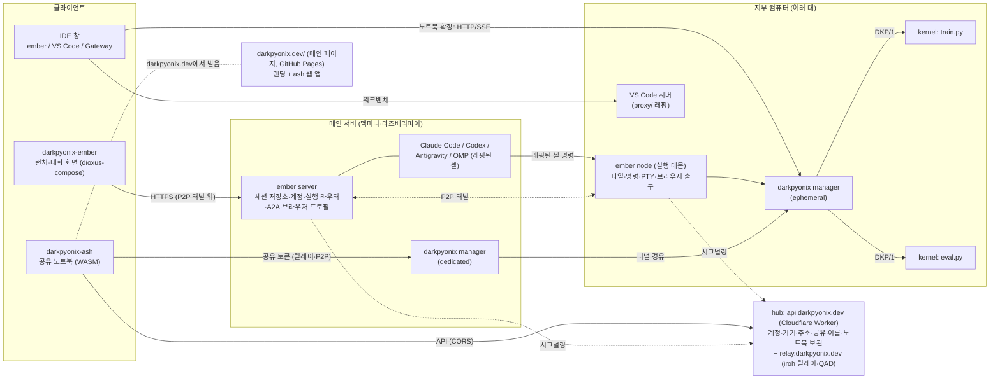
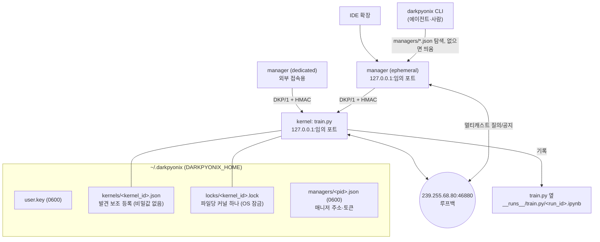
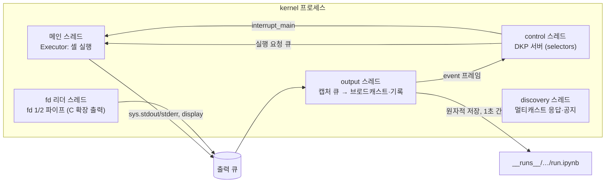
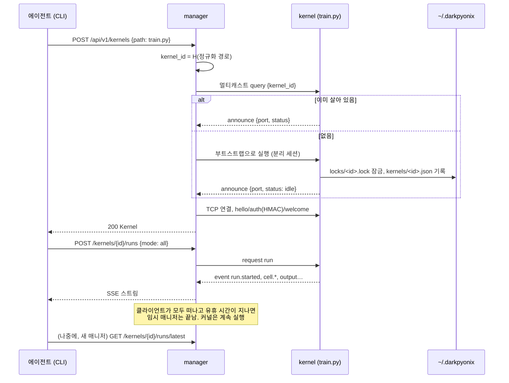
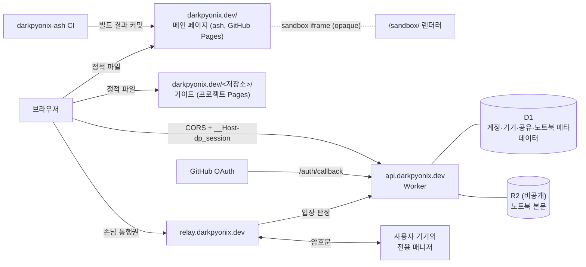
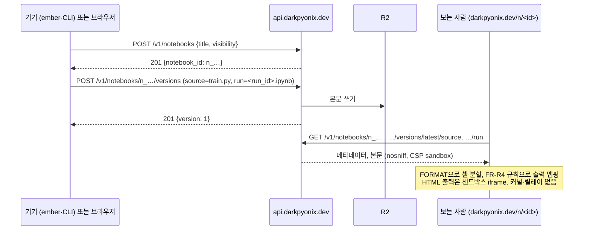
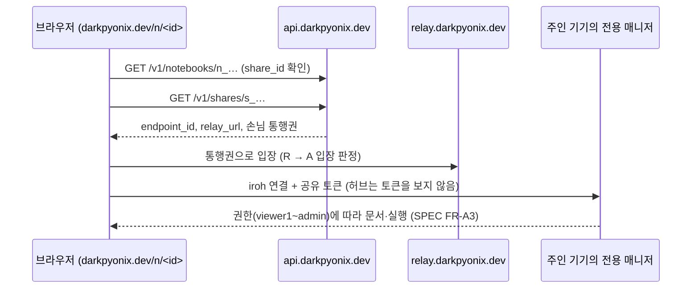

# ARCHITECTURE

DarkPyonix 전체의 프로세스 배치와 데이터 흐름입니다. 이 저장소가 맡는 부분(커널, 매니저, 허브)은 자세히, 다른 저장소가 맡는 부분은 경계만 그립니다. 요구사항 ID는 [SPEC.md](SPEC.md), 와이어 형식은 [PROTOCOL.md](PROTOCOL.md), HTTP API는 [api/](api/)에 있습니다.

## 1. 전체 배치

사용자의 비유를 그대로 씁니다. **프로젝트는 회사, 컴퓨터는 지부**입니다. 메인 서버 한 대가 본사이고, 모든 대화와 계정이 거기 있습니다. 에이전트는 지부를 옮겨 다니며 일합니다.



| 구성 요소 | 저장소 | 역할 |
|---|---|---|
| **kernel** | 이 저장소 `darkpyonix/kernel/darkpyonix/kernel` | 파일 하나에 묶인 실행 프로세스. 표준 라이브러리만 씁니다 |
| **manager** | 이 저장소 `darkpyonix/manager`(Rust) | 커널을 찾고 띄우는 HTTP 앞단. 임시/전용 두 모드 |
| **runtime API** | 이 저장소 `darkpyonix/kernel/darkpyonix` | 노트북 파일이 `import darkpyonix`로 쓰는 API |
| **hub** | 이 저장소 `hub/worker/`, `hub/server/` | api.darkpyonix.dev(Cloudflare Worker): GitHub 계정, 기기 등록, iroh 주소 디렉터리, 공유 해석, HTTPS 이름, 노트북 보관(D1 + R2). relay.darkpyonix.dev(Rust): iroh 릴레이와 QUIC 주소 발견(INTENT D15와 그 개정, §7) |
| **메인 페이지** | `darkpyonix-ash` | darkpyonix.dev 루트: 랜딩과 ash 웹 앱. ash CI가 빌드해 조직 GitHub Pages 사이트(`DarkPyonix.github.io`)에 올립니다. 정적 파일만 내고 위 API를 부릅니다(SPEC FR-H12) |
| ember server / ember node / 클라이언트 | `darkpyonix-ember` | 대화 우선 워크벤치, 셸 래핑, 컴퓨터 전환, A2A, 원격 브라우저 |
| ash | `darkpyonix-ash` | Starboard 포크. darkpyonix.dev 메인 페이지로 배포됩니다. 호스팅한 노트북을 커널 없이 보여 주고, 공유 토큰으로 공유된 커널에 접근합니다 |
| 노트북 렌더러 | `vscode-darkpyonix`, `intellij-darkpyonix` | `.py`/`.pynb` 셀 표시와 실행 기록 맵핑. 그 컴퓨터의 매니저에 붙습니다 |
| IDE 창 워크벤치 | `darkpyonix-ember` (`proxy/`) | 각 컴퓨터의 VS Code 서버를 감싸서 냅니다 |
| 테마 | `vscode-darkpyonix-theme` | 불사조 디자인 테마 |

클라이언트와 ember server 사이, ember server와 각 컴퓨터 사이는 모두 P2P 터널(darkpyonix.dev가 홀펀칭을 돕고 실패하면 중계) 위의 HTTPS입니다. 에이전트 셸 래핑과 머신 이동의 세부(트랜스크립트, 무효화, A2A)는 ember 문서가 정의합니다. 이 문서는 그 경계에서 커널 스택이 무엇을 제공하는지만 다룹니다(§6).

## 2. 한 컴퓨터 안: 커널과 매니저



- **커널은 누구의 자식도 아닙니다.** 매니저가 띄우더라도 새 세션으로 분리되어 시작합니다(INTENT D2). 매니저가 끝나도 커널은 남습니다.
- **매니저는 여러 개가 동시에 떠 있어도 됩니다.** 모두 같은 커널을 발견하고, 같은 사용자 키로 인증합니다(INTENT D5). 에이전트가 기존 매니저의 토큰을 모르거나 떠 있는 매니저가 없으면 CLI가 새 임시 매니저를 띄웁니다.
- **파일당 커널 하나**는 커널이 `locks/<kernel_id>.lock`에 거는 OS 잠금이 보장합니다. 프로세스가 죽으면 OS가 잠금을 풀므로 남은 잠금 파일 때문에 막히는 일이 없습니다.

### 2.1 커널 내부 스레드



사용자 코드는 메인 스레드에서만 돕니다(INTENT D12). 출력은 큐에 넣고 바로 돌아오므로 느린 클라이언트나 디스크가 학습 루프를 붙잡지 않습니다. 인터럽트는 control 스레드가 `_thread.interrupt_main()`으로 메인 스레드에 `KeyboardInterrupt`를 일으킵니다. POSIX와 Windows가 같은 경로를 씁니다.

## 3. 커널 수명



같은 파일에 대해 두 번째 `run`이 들어오면 기본 정책은 거절(`409 busy`, 현재 실행 정보 포함)입니다. 요청에 `on_busy: queue`를 주면 대기열에 넣습니다(SPEC FR-X3). 에이전트가 같은 파일을 두 번 돌리는 문제(INTENT 1.2 C)를 여기서 막습니다.

## 4. 실행 기록

```
experiments/
├─ train.py
└─ __runs__/
   └─ train.py/
      ├─ 20261003-142233-a1f0.ipynb   ← 실행 하나 = 노트북 하나 (nbformat 4)
      ├─ 20261003-150102-77c2.ipynb
      └─ index.json                    ← 실행 목록 요약 (최신순)
```

- 실행 하나(`run`)는 요청 한 번입니다. 파일 전체 실행이든 셀 몇 개든 같습니다.
- 커널은 실행 중에도 최대 1초 간격으로 기록을 원자적으로 다시 씁니다(임시 파일 후 이름 변경). 커널이 죽어도 직전까지의 출력이 남습니다.
- 셀마다 `metadata.darkpyonix`에 소스 해시와 셀 위치를 남깁니다. 클라이언트는 파일을 열 때 최신 기록을 이 해시로 셀에 맵핑합니다. 소스가 바뀐 셀은 "이전 소스의 결과"로 표시할 수 있습니다(SPEC FR-R4).
- 커널 안에서는 `__runs__.current`, `__runs__.latest`, `__runs__[run_id]`로 같은 내용을 dict로 읽고, `run.cells[1].text`처럼 속성으로도 읽습니다(SPEC FR-R3).

## 5. 원격 접근과 공유

```mermaid
flowchart LR
  ASH2["ash (브라우저)<br/>darkpyonix.dev/s/&lt;share&gt;#&lt;token&gt;"] -->|GET /v1/shares/&lt;share&gt;| HUB2["api.darkpyonix.dev"]
  ASH2 -->|릴레이(손님 통행권) 또는 홀펀칭| DM2["dedicated manager<br/>(메인 서버 또는 지부)"]
  DM2 -->|권한: viewer1·2·3| K3["kernel"]
```

- 외부 접근은 항상 **전용 매니저**를 거칩니다. 커널은 루프백에만 열립니다.
- 공유 토큰은 커널(=파일)마다 발급하며 권한은 2025년 설계를 따릅니다. `viewer1` 코드만, `viewer2` 코드와 실행 기록, `viewer3` 코드·실행 기록·실행, `admin` 전부입니다(SPEC FR-A3).
- 허브는 연결을 이어 줄 뿐이고, 내용은 끝단 사이에서 암호화합니다(SPEC NFR-H1, Draft).

## 6. ember와의 경계

Ember의 에이전트 CLI는 메인 서버에서 돌고, 실행 라우터가 도구 호출을 세션의 현재 컴퓨터에 있는 ember node(실행 데몬)로 보냅니다(Ember ARCHITECTURE §1.2). 그 셸 안에서 에이전트가 쓰는 것은 평범한 CLI입니다.

| 에이전트가 하던 일 | DarkPyonix로 바뀐 형태 |
|---|---|
| `python train.py > log.txt &` | `darkpyonix run train.py --detach` (기록은 자동) |
| `pkill -f train.py` | `darkpyonix stop train.py` (인터럽트, 상태 유지) |
| `tail -f log.txt` | `darkpyonix logs train.py --follow` |
| 같은 파일을 실수로 다시 실행 | `409 busy`와 현재 실행 정보가 돌아옴 |
| 무엇을 계산했는지 잊음 | `darkpyonix vars train.py`, 커널 안의 `__runs__` |

ember server는 지부의 매니저 HTTP API를 터널 너머에서 그대로 부릅니다. 대화 화면이 실행 상태와 최신 출력을 보여 줄 때 쓰는 것도 이 API입니다. 커널 스택은 대화, 계정, 머신 전환을 알지 못합니다.

## 7. darkpyonix.dev 호스트 배치

INTENT D15 개정(2026-10-03, 제안): 동적 기능은 서브도메인, 루트는 그것을 띄우는 정적 메인 페이지입니다. 프로젝트 가이드는 지금처럼 `darkpyonix.dev/<저장소>/`에 있습니다.

| 호스트 | 내는 것 | 구현 위치 | 배포 |
|---|---|---|---|
| `darkpyonix.dev/` | 메인 페이지: 랜딩, ash 웹 앱(`/n/<id>`, `/s/<id>#<token>`, `/link`, `/new`), 렌더러 `/sandbox/`, Flathub 검증 파일 | darkpyonix-ash 웹 빌드 | 조직 GitHub Pages `DarkPyonix/DarkPyonix.github.io`(`main` 루트). ash CI가 배포 키로 빌드 결과를 커밋. 동적 경로는 `404.html` 앱, CSP는 meta |
| `darkpyonix.dev/<저장소>/` | 프로젝트 가이드(예: `/dioxus-compose/`) | 각 저장소 | 각 저장소의 GitHub Pages 프로젝트 사이트 |
| `api.darkpyonix.dev` | 허브 API: 로그인, 기기, 주소 디렉터리(pkarr), 공유 해석, 이름·ACME TXT, 설정, 노트북 보관, 릴레이 입장 판정 | `hub/worker/`(TypeScript) | Cloudflare Worker custom domain, D1(메타데이터), R2(노트북 본문, 비공개), Cron |
| `relay.darkpyonix.dev` | iroh 릴레이, QAD(UDP 7842) | `hub/server/`(Rust) | VPS, DNS only(SPEC FR-H3) |
| `<name>.darkpyonix.dev` | 사용자 메인 서버 | 사용자의 ember server | 사용자 기기, 인증서는 ACME DNS-01(SPEC FR-H5) |



- **쿠키는 API 호스트에만 있습니다.** `__Host-` 쿠키는 호스트 전용이라 `api.darkpyonix.dev`에만 붙고, 메인 페이지는 `credentials: "include"`로 부릅니다. 두 호스트는 같은 사이트라 `SameSite=Lax` 쿠키가 실립니다. CORS는 메인 페이지 출처 하나에만 엽니다(SPEC FR-H13). 로그인은 API 호스트로 최상위 이동했다가 메인 페이지 경로로 돌아오고, URL 조각(공유 토큰)은 `sessionStorage`에 두었다 되살려 API로 보내지 않습니다.
- **GitHub Pages라서.** 응답 헤더를 못 정하므로 CSP는 meta로 두고, 클릭재킹은 `SameSite=Lax`(끼워진 페이지의 API 요청에 쿠키가 없음)와 앱의 프레임 검사로 막습니다. 교차 출처 격리가 필요한 ash 화면만 ash의 서비스 워커로 COOP/COEP를 덧붙입니다. 노트북 보기와 라이브 열기는 격리가 필요 없습니다(SPEC FR-H12).
- **남의 내용은 샌드박스에서만.** 노트북 출력의 HTML·스크립트와 ash가 브라우저에서 돌리는 코드는 렌더러 페이지 `/sandbox/`를 `allow-same-origin` 없이 읽은 iframe(opaque 출처)에서 돌고, 내용은 `postMessage`로 받습니다(SPEC NFR-H3). 렌더러를 별도 등록 도메인으로 옮길지는 열린 질문입니다(PROJECT Q10).

### 7.1 노트북 올리기와 읽기 전용 보기



### 7.2 라이브 커널로 열기


